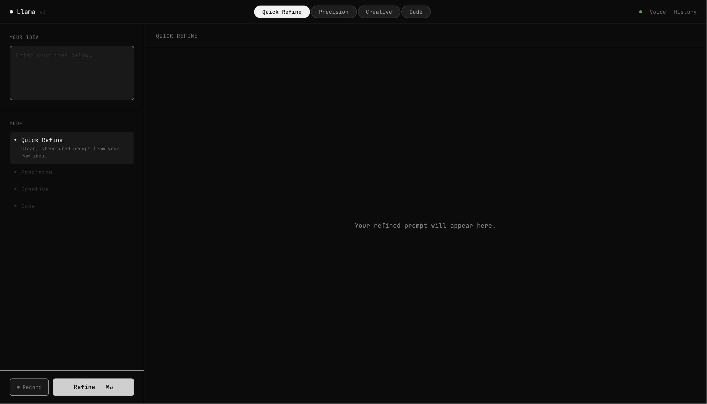

# Llama — AI Prompt Engineer

A voice-activated prompt engineering tool that runs locally on your machine. Say **"hey llama"** and a sleek browser UI opens, ready to transform your raw ideas into polished AI prompts.



---

## What it does

Most people struggle to write good AI prompts. Llama takes your rough idea — spoken or typed — and refines it into a clear, effective prompt using a local LLM. Everything runs on your machine. No data leaves your computer.

**Four refinement modes:**
- **Quick Refine** — clean, structured prompt from your raw idea
- **Precision** — step-by-step, zero-ambiguity instructions
- **Creative** — vivid, evocative prompts for creative tasks
- **Code** — technical specs for engineering tasks

**Key features:**
- Wake word activation — say "hey llama" to open the app
- Voice input — speak your idea, Whisper transcribes it instantly
- Streaming output — watch the refined prompt generate in real time
- Better versions — analyze weak points and get 3 alternative refinements
- Session history — revisit and reload any past refinement
- 100% local — runs on your machine using Ollama, no API keys needed

---

## Requirements

- macOS (tested on macOS 14+)
- [Ollama](https://ollama.com) installed and running
- Python 3.10+
- A microphone (for voice input)

---

## Setup

**1. Install Ollama and pull the model**
```bash
# Install Ollama from https://ollama.com, then:
ollama pull llama3.2:3b
```

**2. Clone the repo**
```bash
git clone https://github.com/YOUR_USERNAME/llama-prompt-engineer.git
cd llama-prompt-engineer
```

**3. Create a virtual environment and install dependencies**
```bash
python3 -m venv venv
source venv/bin/activate
pip install -r requirements.txt
```

**4. Run the app**
```bash
python llama_web.py
```

The browser opens automatically at `http://localhost:7337`.

---

## Voice activation (optional)

To enable "hey llama" wake word detection, run the daemon in a separate terminal:

```bash
python llama_daemon.py
```

Minimize it and leave it running. Saying "hey llama" will open the browser app automatically.

---

## Usage

1. Type your raw idea into the **Your idea** box — or click **Record** and speak it
2. Select a refinement mode (Quick Refine, Precision, Creative, or Code)
3. Click **Refine** or press `⌘↵`
4. The refined prompt streams in on the right
5. Click **Better versions** to get 3 alternative refinements with a weak-point analysis
6. Click **Copy** to copy the result to your clipboard

---

## Tech stack

| Component | Technology |
|-----------|-----------|
| LLM | [Ollama](https://ollama.com) + llama3.2:3b (local) |
| Speech-to-text | [OpenAI Whisper](https://github.com/openai/whisper) (local) |
| Web server | Flask |
| Frontend | Vanilla HTML/CSS/JS |
| Wake word | Whisper + sounddevice |

---

## Project structure

```
llama-prompt-engineer/
├── llama_web.py          # Flask server + API endpoints
├── llama_terminal.py     # Terminal UI version
├── llama_daemon.py       # Background wake word listener
├── templates/
│   └── index.html        # Web UI
├── start.sh              # Launcher script
└── requirements.txt
```

---

## Keyboard shortcuts

| Shortcut | Action |
|----------|--------|
| `⌘↵` | Refine |
| `⌘↵` in adjust box | Adjust |

---

Built by [@ethangarson](https://www.linkedin.com/in/ethangarson)
